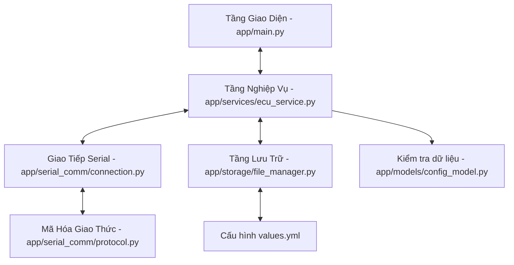

# Kiến Trúc Ứng Dụng ECU Configurator

Tài liệu này mô tả chi tiết kiến trúc phân lớp của ứng dụng cấu hình và giám sát ECU.

## 1. Tổng Quan Kiến Trúc

Ứng dụng được thiết kế theo nguyên lý **Phân tách mối quan tâm (Separation of Concerns)** nhằm tách biệt giao diện người dùng, logic nghiệp vụ, giao tiếp phần cứng và lưu trữ dữ liệu.

Sơ đồ luồng dữ liệu và tương tác giữa các thành phần:

---

## 2. Chi Tiết Các Lớp (Layers)

### 2.1. Tầng Giao Diện (UI Layer)
- **Vị trí**: [app/main.py](file:///d:/Projects/ConfigApp/app/main.py)
- **Công nghệ**: CustomTkinter (Thư viện UI hiện đại phát triển dựa trên Tkinter).
- **Nhiệm vụ**:
  - Nhận tương tác trực tiếp từ người dùng (nhập thông số, nhấn kết nối, nạp/đọc cấu hình).
  - Hiển thị trực quan dữ liệu trạng thái thời gian thực của ECU (Nhiệt độ, Điện áp, Uptime).
  - Tích hợp khung hiển thị Log hoạt động thời gian thực bằng cách liên kết với luồng logger hệ thống.
  - Sử dụng các luồng chạy ngầm (`threading.Thread`) để gọi dịch vụ ghi/đọc, giữ cho giao diện luôn phản hồi mượt mà không bị đơ (non-blocking UI).

### 2.2. Tầng Nghiệp Vụ (Service Layer)
- **Vị trí**: [app/services/ecu_service.py](file:///d:/Projects/ConfigApp/app/services/ecu_service.py)
- **Nhiệm vụ**:
  - Đóng vai trò bộ điều phối (Controller) trung gian.
  - Chuyển đổi dữ liệu từ mô hình cấu hình thành dạng byte nhị phân để truyền đi, và giải mã byte nhận được thành các đối tượng dữ liệu có cấu trúc.
  - Quản lý đồng bộ luồng: Khi gửi lệnh cần phản hồi (như `SET_CONFIG`), luồng UI sẽ tạm dừng chờ (với timeout) trên một đối tượng `threading.Event`, đối tượng này sẽ được giải phóng khi luồng đọc Serial nền nhận được gói tin `ACK`/`NACK` tương ứng.

### 2.3. Tầng Giao Tiếp Serial (Serial Communication Layer)
- **Vị trí**: [app/serial_comm/](file:///d:/Projects/ConfigApp/app/serial_comm/)
  - `connection.py`: Quản lý mở/đóng cổng Serial vật lý bằng `pyserial`. Khởi chạy luồng chạy ẩn liên tục (`SerialReaderThread`) chuyên đọc dữ liệu từ phần cứng về.
  - `protocol.py`: Định nghĩa cấu trúc khung gói tin (Packet frame) và thực hiện tính toán mã kiểm tra lỗi CRC-16 Modbus bảo vệ tính toàn vẹn của dữ liệu truyền nhận.

### 2.4. Tầng Lưu Trữ (Storage Layer)
- **Vị trí**: [app/storage/file_manager.py](file:///d:/Projects/ConfigApp/app/storage/file_manager.py)
- **Nhiệm vụ**:
  - Thực hiện đọc ghi dữ liệu cấu hình cục bộ ra các file YAML (bao gồm file cấu hình khởi chạy `values.yml`) hoặc JSON thông qua thư viện `pyyaml`.
  - Kết hợp với mô hình Pydantic để kiểm tra định dạng dữ liệu (validation) khi nạp file từ bên ngoài vào ứng dụng.

### 2.5. Tầng Mô Hình Dữ Liệu (Models)
- **Vị trí**: [app/models/config_model.py](file:///d:/Projects/ConfigApp/app/models/config_model.py)
- **Nhiệm vụ**:
  - Sử dụng `Pydantic v2` định nghĩa cấu trúc chặt chẽ cho cấu hình Serial, cấu hình giao diện ứng dụng, và các tham số giới hạn của ECU.
  - Thực hiện xác thực giá trị dữ liệu tại ranh giới đầu vào (ví dụ: kiểm tra Device ID phải từ 1-255, ngưỡng nhiệt độ cao phải lớn hơn ngưỡng nhiệt độ thấp...).
