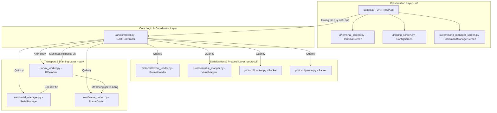

# Kiến trúc Hệ thống (System Architecture)

Tài liệu này mô tả kiến trúc phân lớp của dự án **art_ecu_firmware (UART Terminal Tool)**.

Hệ thống được thiết kế theo mô hình phân tách mối quan tâm (Separation of Concerns), phân tách lớp giao diện người dùng (Presentation TUI) khỏi logic nghiệp vụ giao tiếp cổng nối tiếp và giao thức đóng gói dữ liệu (Business & Protocol Logic).

---

## 1. Sơ đồ khối kiến trúc (Architecture Diagram)

---

## 2. Chi tiết các lớp thành phần

### Lớp Giao diện (Presentation Layer - `ui/`)
*   **[ui/app.py](file:///home/datphan/job/hoa/ECU_tools/uart_tool/ui/app.py) (`UARTToolApp`):** Điểm khởi chạy giao diện Textual, nhận đầu vào từ bàn phím/chuột của người dùng và hiển thị thông báo. Lớp này đăng ký các callback sự kiện với `UARTController` để cập nhật trạng thái kết nối và log tin nhắn nhận được lên màn hình.
*   **Màn hình chức năng:**
    *   `TerminalScreen`: Hiển thị nhật ký truyền/nhận (TX/RX) dạng text/hex.
    *   `ConfigScreen`: Cho phép cấu hình cổng COM, baudrate, và các tham số giao thức (COBS, Legacy, CRC Type, Endianness).
    *   `CommandManagerScreen`: Quản lý danh sách các lệnh gửi (TX) và tin nhắn nhận (RX) định nghĩa trong YAML.

### Lớp Điều phối (Coordinator Layer - `uart/controller.py`)
*   **`UARTController`:** Lớp quan trọng nhất của hệ thống, đóng vai trò "đầu não" điều phối. Nó khởi tạo và kết nối tất cả các thành phần logic bên dưới. Bằng việc cung cấp một tập các API sạch (`connect`, `disconnect`, `send_text`, `send_command`), lớp này triệt tiêu hoàn toàn sự phụ thuộc trực tiếp của giao diện UI vào chi tiết truyền nhận bytes hay cấu trúc cấu hình YAML.

### Lớp Giao thức & Dịch dữ liệu (Protocol Layer - `protocol/`)
*   **`FormatLoader`:** Đọc và ghi các file cấu hình YAML (`commands.yaml`, `rx_messages.yaml`, `maps.yaml`).
*   **`Packer` / `Parser`:** Đóng gói các kiểu dữ liệu có cấu trúc (`uint8`, `uint16`, `float`...) thành mảng bytes hoặc ngược lại theo định nghĩa trường dữ liệu.
*   **`ValueMapper`:** Ánh xạ các giá trị số thô sang chuỗi mô tả thân thiện (ví dụ: `0` -> `OFF`, `1` -> `ON`) dựa theo enum hoặc bảng map.

### Lớp Vận chuyển & Tạo khung (Transport & Framing Layer - `uart/`)
*   **`SerialManager`:** Quản lý kết nối vật lý với cổng Serial, đọc ghi dữ liệu thô và ghi log tập tin.
*   **`FrameCodec`:** Đảm nhận việc đóng khung dữ liệu truyền đi và gom các byte nhận được thành gói tin hoàn chỉnh dựa theo thuật toán (Legacy Header/CRC16 Modbus hoặc COBS Encoding).
*   **`RXWorker`:** Một luồng chạy ngầm độc lập (Thread) chuyên trách việc liên tục đọc dữ liệu từ cổng Serial và đẩy vào bộ giải khung `FrameCodec`.
